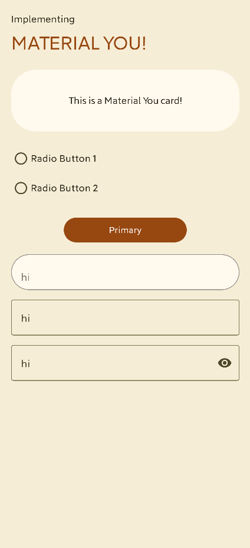
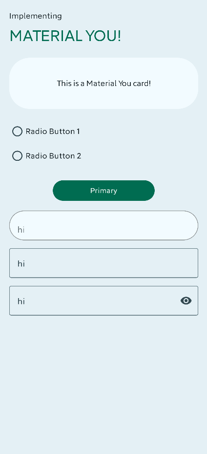
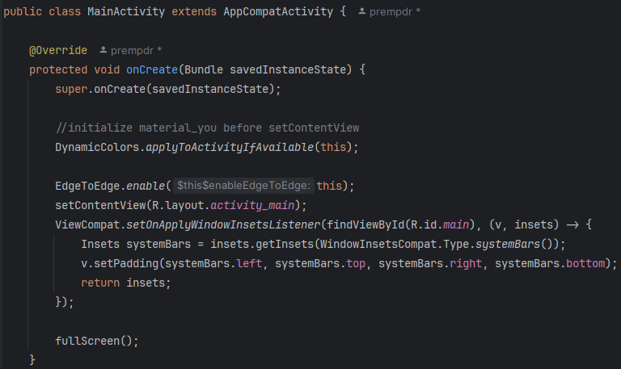
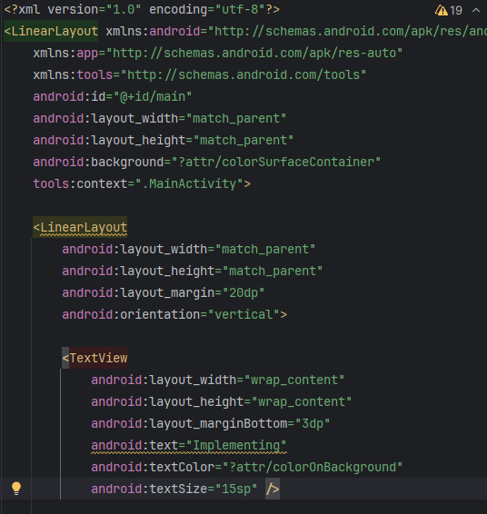
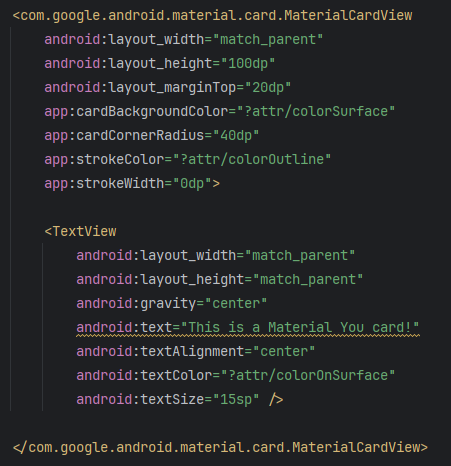
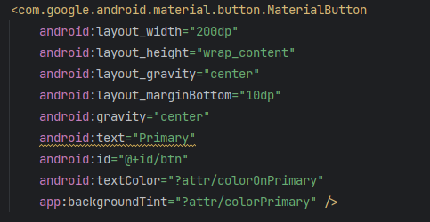
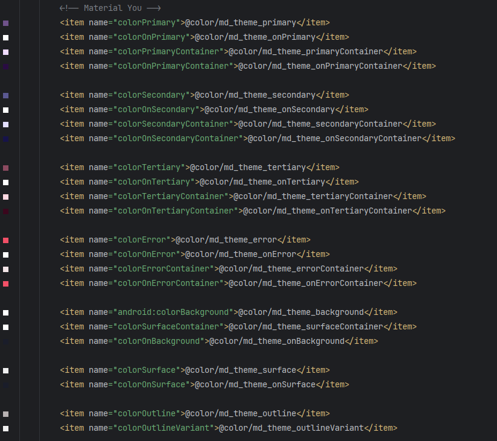

# Implementing Material You Colors on your App

[](https://forthebadge.com)
[](http://forthebadge.com)

Implement android's new `Material You` colors for `API 31+` with supports for `API 25+`

   

# Installation

1. Make your own theme files from [Here](https://material-foundation.github.io/material-theme-builder/) , _**you can add your own colors**_
   - [x] (you can also use this project files)
2. Copy those files to your projects respective directories, both `light` and `dark` variant
3. On `your activity.java` file use :
   ```
   DynamicColors.applyToActivityIfAvailable(this);
   ```
   before `setContentView` line

   Here see the usage:
   
   

5. Have a look at the color usages:
   - for backgrounds use `?attr/colorSurfaceContainer`
   - for backgrounds text `?attr/colorOnBackground`
   - for cards use `?attr/colorSurface`
   - for cards text `?attr/colorOnSurface`
   - fot buttons `?attr/colorPrimary` or `?attr/colorSecondary` or `?attr/colorTertiary`
   
   Here see the usage:
   
   
   
   

7. More colors:
   
   
